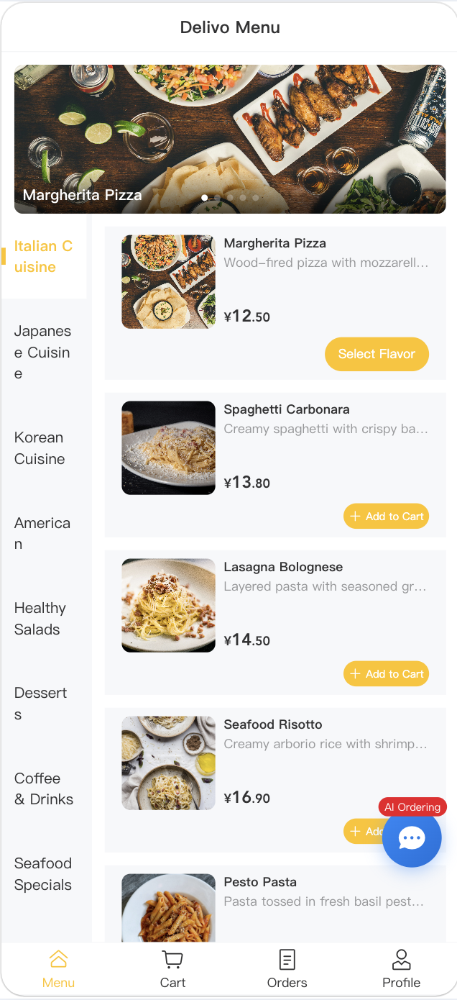
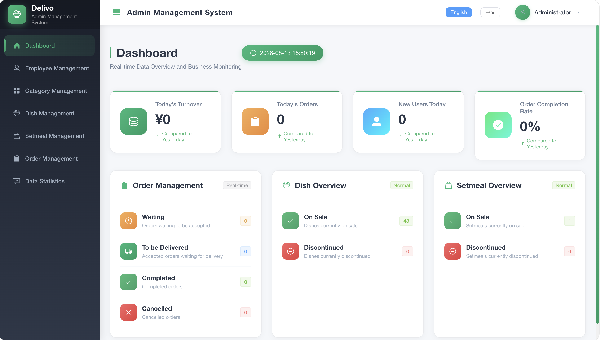
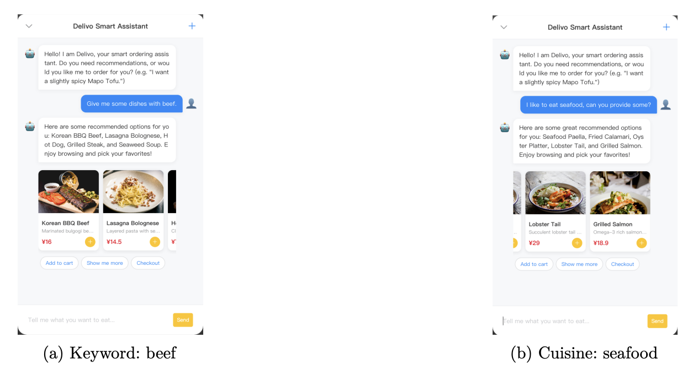
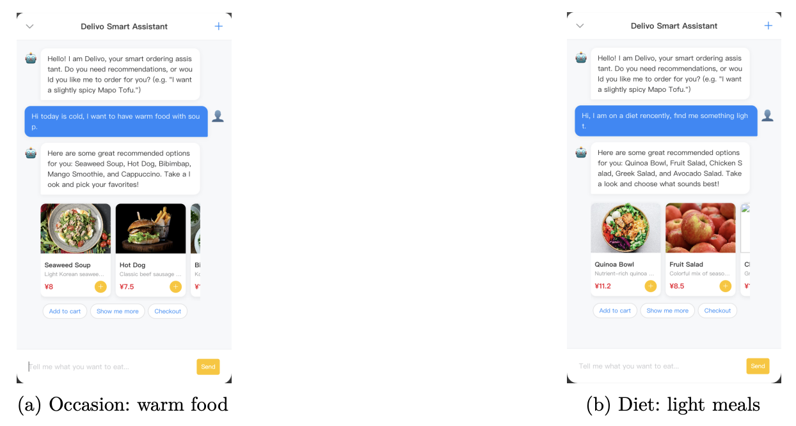
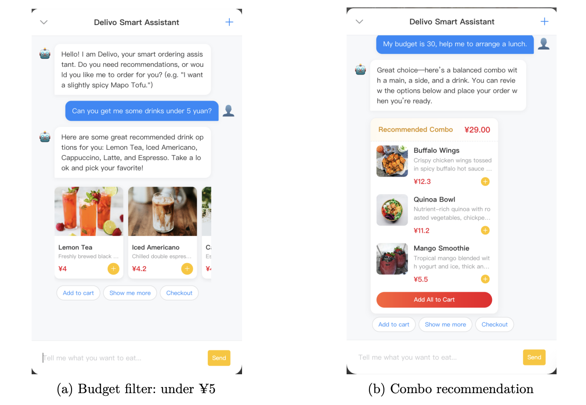
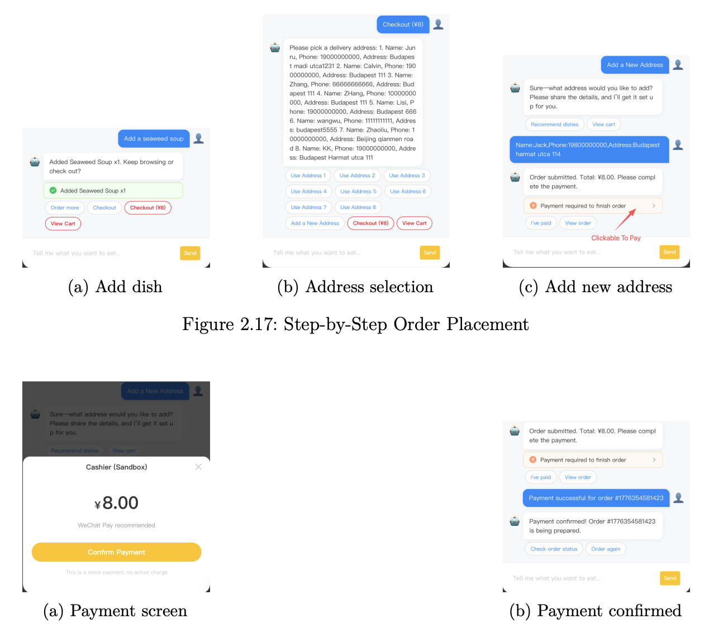
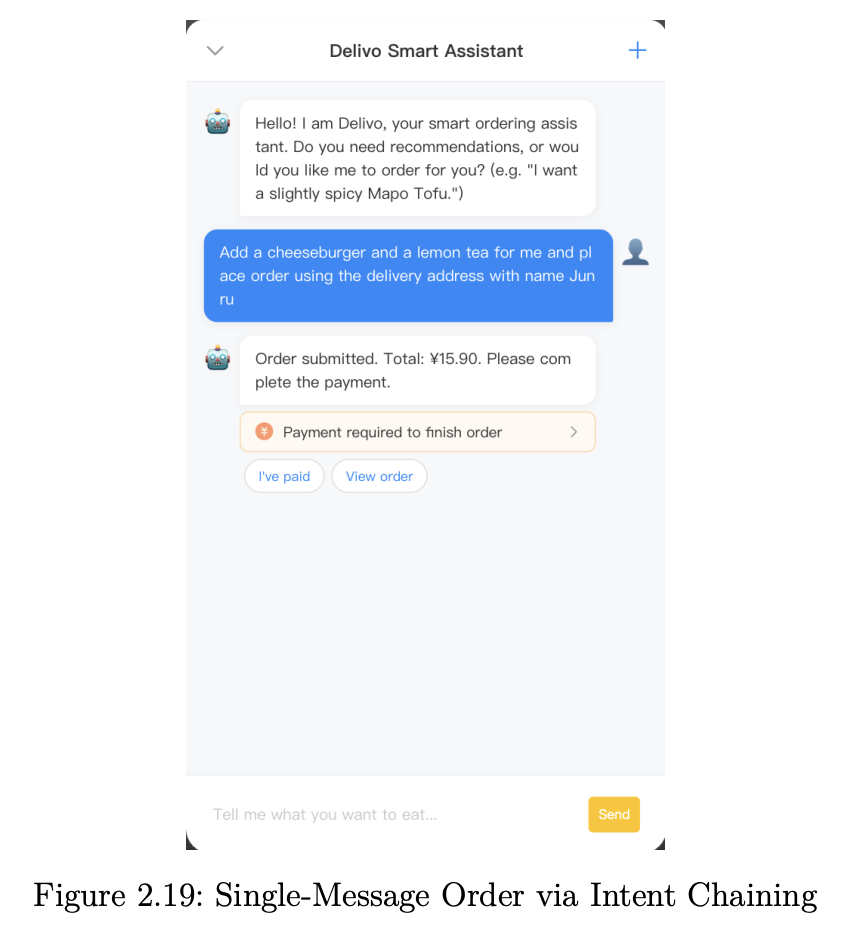
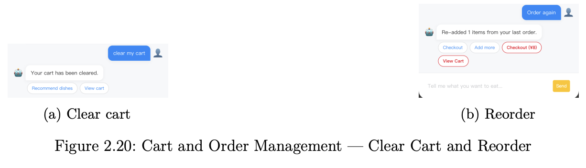
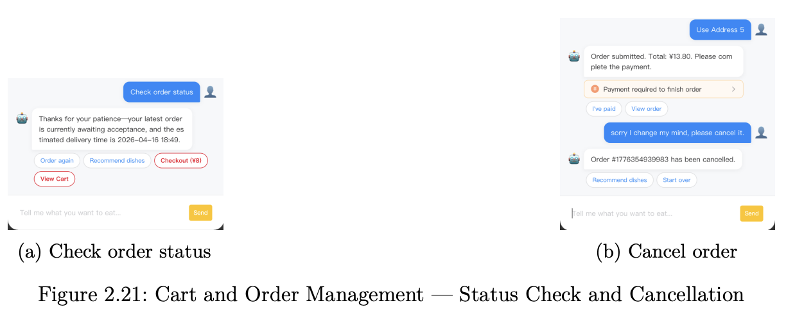
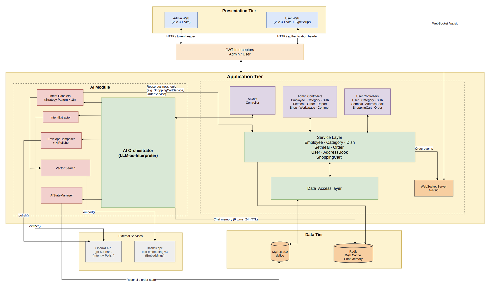

## Delivo - A food delivery platform with AI Assitance

[]() []() []() []() []() []()

[toc]

### Quick start with docker

**Before start**
- Make sure your pc installed Docker
- Make sure you have an API key for embedding model and one more for the LLM. (Personally, I use gpt-5.4-nano and text-embedding-v3)


**1. Clone the project and create a .env file under the project root directory.** 
```bash
git clone https://github.com/ToxicCalvin/delivo.git
cd delivo
touch .env
```

**2. Inside the .env file, configure your API keys:**

```env
DASHSCOPE_API_KEY=your_actual_embedding_model_api_key
OPENAI_API_KEY=your_actual_llm_api_key
```

**3. Make sure your Docker is running, then use the following command to build and start the whole project:**

```bash
docker compose -f docker-compose.yml -f docker-compose.prod.yml up -d --build
```

*(To stop the project, run: `docker compose -f docker-compose.yml -f docker-compose.prod.yml down`)*

**4. Access the applications in your browser:**

- **User Web:** [http://localhost:8081](http://localhost:8081)
- **Admin Web:** [http://localhost:8082](http://localhost:8082)
  - *Default Admin Credentials:* Username: `admin` | Password: `123456`

*(Note: Because the repository is named `delivo`, your local folder structure will have a nested `delivo/delivo` path for the Java backend code. If you wish to run the backend natively without Docker, ensure you `cd delivo` again before running Maven or Spring Boot commands.)*


### Project Overview

Delivo is a full-stack food delivery platform and business solution that I designed and implemented during my undergraduate studies in Computer Science at Eötvös Loránd University. 

The project mainly explores an **LLM + Java** approach to improve the reliability of an AI assistant when handling the strict deterministic business logic requirements of the food service industry, with the goal of minimizing LLM hallucinations as much as possible.

The core architecture of the project was designed and implemented independently by me, while certain components were developed with reference to and inspiration from existing open-source projects.

The project consists of two main components:

**Customer Application:** Allows customers to browse menus, search for dishes, manage their shopping carts&address, place and pay for orders, and interact with an AI assistant to achieve some task.

<p align="center">
  
</p>

**Admin Dashboard:** Enables restaurant administrators to manage dishes and meal packages, process orders, manage employees, and view business and operational statistics.



### Key Features

**AI Assistant can do**

#### Dish Recommendation. 

- By keyword or cuisine 



- By taste preference and occasion.



- By budget
- Combo recommendation.



#### Place order (step by step)



#### Single-message ordering (One step)

<p align="center">
  
</p>

- Other Supported Operations

  - Clear cart, Reorder, Check order status, Cancel order etc..

  

  

### Technology Stack

Springboot2.7

LangChain4j

MySQL, MyBatis, Redis

Websocket

Docker

Git

etc.

### Core System Architecture

#### System Architecture

Delivo follows a classical three-tier physical deployment (presentation/application/data), with the entire backend packaged as a single Spring Boot monolith. Logically, the codebase adopts a layered architecture (Controller → Service → Mapper) as its backbone, while the AI module introduces an orchestration layer that sits alongside, rather than above. The system serves two client applications — an admin and a customer-facing ordering interface — both implemented as Vue 3 single-page applications. 



To be noticed, the AI assistant in this project is not an “Agent” in the strict sense. Instead, the LLM is constrained to handle only two tasks that are difficult to implement reliably with traditional code:

1. **Convert users’ natural-language requests into structured data**
    *(Role 1: Natural Language → JSON Intent)*
2. **Convert structured results into natural-language responses that users can easily understand**
    *(Role 2: Structured Result → Natural-Language Response)*

Overall, this trade-off sacrifices some of the “intelligence” of the AI assistant in exchange for greater **engineering robustness, predictability, and user experience**.

### Limitation and onging improvement

#### In-memory vector database and lack of hot-updating

During the thesis work, to simplify development, the system uses an InMemoryEmbeddingStore which only resides in the local memory of the single JVM instance. 
Furthermore, dish embeddings are currently generated only once during the application startup phase. If a restaurant adds, updates, or deletes a dish via the management backend, the system does not support hot-updating the vector database.

To resolve this, one good way is to use professional vector database and event-driven mechanism (such as Kafka or RabbitMQ).

#### AI assistance limitation

**Under some certain complex user requests, the current AI architecture may not provide a best user experience.**

For example:

**1.User requries invloves complex and unperdictable parameters.**
“Remove the two most expensive spicy dishes from my shopping cart.”
**2.Requests involving conditional logic. (LLM can not reach the Database and Redis currently)**
“Do you have any mango-flavored ice cream? If there is, add one to my order, otherwise, just checkout.”

#### Monolithic architecture

### Contact
Zhang Junru -  joey1538293327@gmail.com

### License
This project is licensed under the MIT License - see the [LICENSE](LICENSE) file for details.


